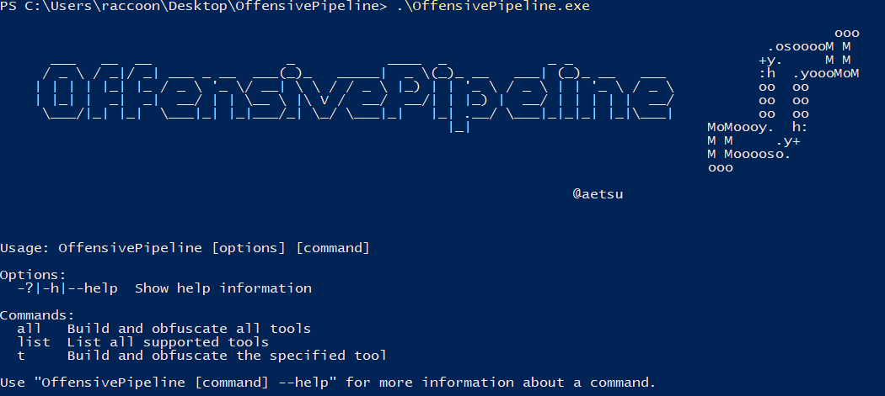
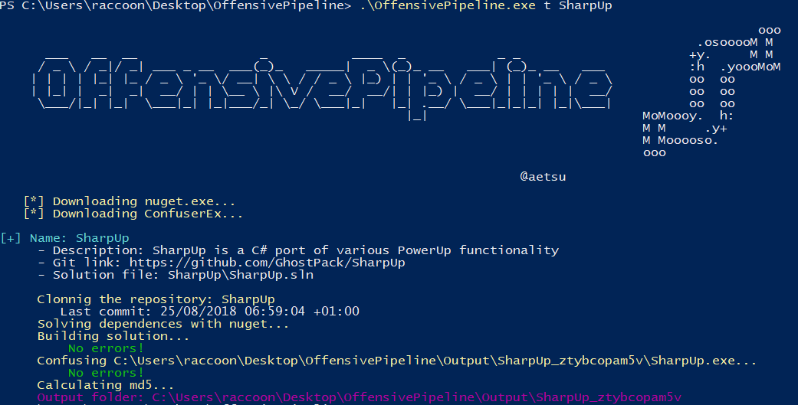
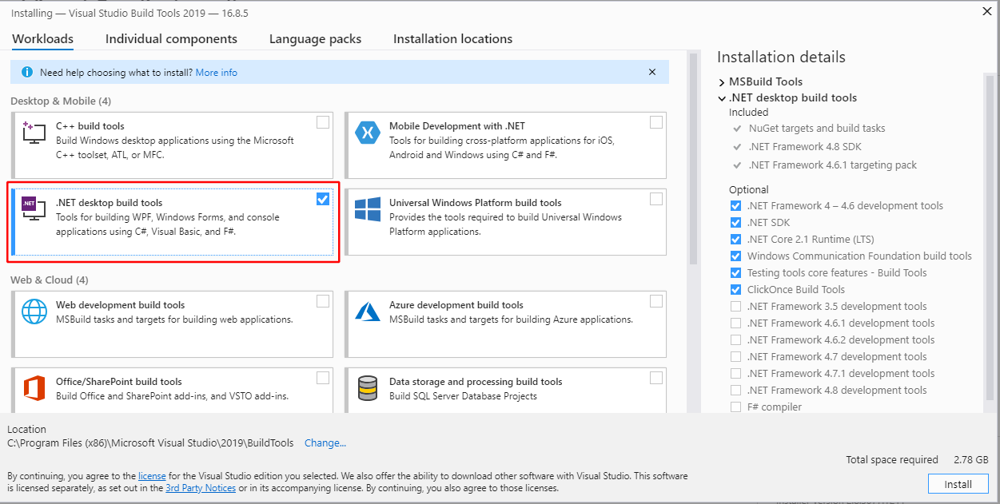

# OffensivePipeline


**OffensivePipeline** allows to download, compile (without Visual Studio) and obfuscate C# tools for Red Team exercises.

OffensivePipeline downloads the tool from the git repository, then compiles it with *msbuild* and finally obfuscates it with [ConfuserEx](https://github.com/mkaring/ConfuserEx/tree/v1.4.1).


## Examples
- List all tools:
```
OffensivePipeline.exe list
```
- Build all tools:
```
OffensivePipeline.exe all
```
- Build a tool
```
OffensivePipeline.exe t toolName
```



## Add new tools
The scripts for downloading the tools are in the **Tools** folder in **yml** format. New tools can be added by creating new *yml* files with the following format:
- *Rubeus.yml* file:
```yml
tool:
  - name: Rubeus
    description: Rubeus is a C# toolset for raw Kerberos interaction and abuses
    gitLink: https://github.com/GhostPack/Rubeus
    solutionPath: Rubeus\Rubeus.sln
```


## Requirements for the release version (Visual Studio 2019 is not required)
- Microsoft .NET Framework 3.5 Service Pack 1 (for some tools): https://www.microsoft.com/en-us/download/details.aspx?id=22
- Build Tools for Visual Studio 2019: https://visualstudio.microsoft.com/thank-you-downloading-visual-studio/?sku=BuildTools&rel=16
    - Install .NET desktop build tools
    
- Disable the antivirus :D
- Teste on Windows 10 Pro - Version 20H2 - Build 19042.631


## Requirements for build
- Net framework 3.5.1 (for some tools): https://www.microsoft.com/en-us/download/details.aspx?id=22
- Visual Studio 2019 -> https://visualstudio.microsoft.com/thank-you-downloading-visual-studio/?sku=Community&rel=16
    - Install .NET desktop build tools


## Supported tools
- Internal-Monologue:
    - Description: Retrieving NTLM Hashes without Touching LSASS
    - GitLink: https://github.com/eladshamir/Internal-Monologue
- InveighZero:
    - Description: InveighZero is a C# LLMNR/NBNS/mDNS/DNS/DHCPv6 spoofer and man-in-the-middle tool
    - GitLink: https://github.com/Kevin-Robertson/InveighZero
- Rubeus:
    - Description: Rubeus is a C# toolset for raw Kerberos interaction and abuses
    - GitLink: https://github.com/GhostPack/Rubeus
- Seatbelt:
    - Description: Seatbelt is a C# project that performs a number of security oriented host-survey "safety checks" relevant from both offensive and defensive security perspectives.
    - GitLink: https://github.com/GhostPack/Seatbelt
- SharpChromium:
    - Description: SharpChromium is a .NET 4.0+ CLR project to retrieve data from Google Chrome, Microsoft Edge, and Microsoft Edge Beta. Currently, it can extract
    - GitLink: https://github.com/djhohnstein/SharpChromium
- SharpDPAPI:
    - Description: SharpDPAPI is a C# port of some DPAPI functionality from @gentilkiwi's Mimikatz project.
    - GitLink: https://github.com/GhostPack/SharpDPAPI
- SharpGPOAbuse:
    - Description: SharpGPOAbuse is a .NET application written in C# that can be used to take advantage of a user's edit rights on a Group Policy Object (GPO) in order to compromise the objects that are controlled by that GPO.
    - GitLink: https://github.com/FSecureLABS/SharpGPOAbuse
- SharpHound3:
    - Description: C# Rewrite of the BloodHound Ingestor
    - GitLink: https://github.com/BloodHoundAD/SharpHound3
- SharpMove:
    - Description:  .NET authenticated execution for remote hosts
    - GitLink: https://github.com/0xthirteen/SharpMove
- SharpRDP:
    - Description:  Remote Desktop Protocol Console Application for Authenticated Command Execution
    - GitLink: https://github.com/0xthirteen/SharpRDP
- Sharp-SMBExec:
    - Description: A native C# conversion of Kevin Robertsons Invoke-SMBExec powershell script
    - GitLink: https://github.com/checkymander/Sharp-SMBExec
- SharpSpray:
    - Description: SharpSpray a simple code set to perform a password spraying attack against all users of a domain using LDAP and is compatible with Cobalt Strike.
    - GitLink: https://github.com/jnqpblc/SharpSpray
- SharpStay:
    - Description: .NET Persistence
    - GitLink: https://github.com/0xthirteen/SharpStay
- SharpUp:
    - Description: SharpUp is a C# port of various PowerUp functionality
    - GitLink: https://github.com/GhostPack/SharpUp
- SharpView:
    - Description: .NET port of PowerView
    - GitLink: https://github.com/tevora-threat/SharpView
- SharpWMI:
    - Description: SharpWMI is a C# implementation of various WMI functionality.
    - GitLink: https://github.com/GhostPack/SharpWMI
- ThreatCheck:
    - Description: Modified version of Matterpreter's DefenderCheck
    - GitLink: https://github.com/rasta-mouse/ThreatCheck
- Watson:
    - Description: Watson is a .NET tool designed to enumerate missing KBs and suggest exploits for Privilege Escalation vulnerabilities.
    - GitLink: https://github.com/rasta-mouse/Watson
- winPEAS:
    - Description: Privilege Escalation Awesome Scripts SUITE
    - GitLink: https://github.com/carlospolop/privilege-escalation-awesome-scripts-suite
