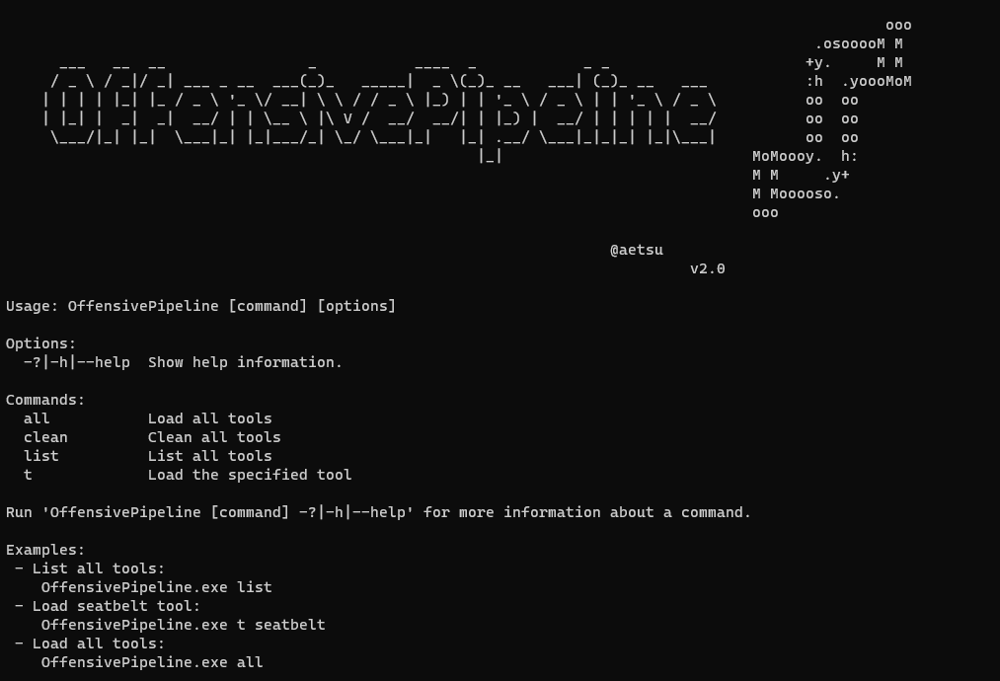
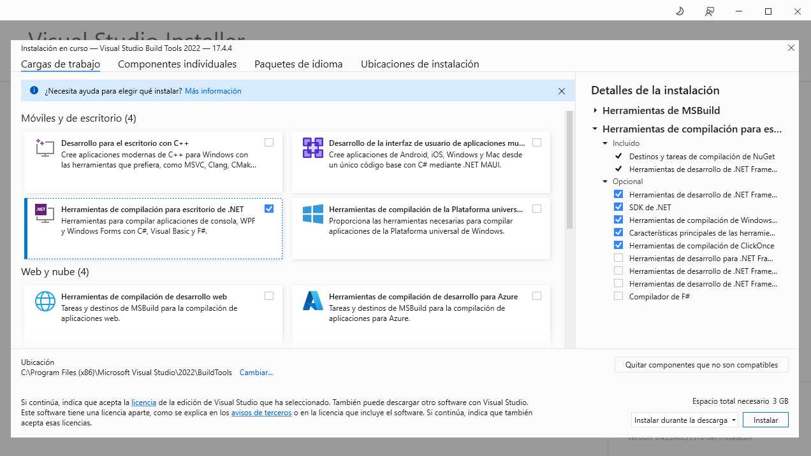

# OffensivePipeline



OfensivePipeline allows you to download and build C# tools, applying certain modifications in order to improve their evasion for Red Team exercises. A common use of OffensivePipeline is to download a tool from a Git repository, randomise certain values in the project, build it, obfuscate the resulting binary and generate a shellcode.

## Features

- Currently only supports C# (.Net Framework) projects
- Allows to clone public and private (you will need credentials :D) git repositories
- Allows to work with local folders
- Randomizes project GUIDs
- Randomizes application information contained in AssemblyInfo
- Builds C# projects
- Obfuscates generated binaries
- Generates shellcodes from binaries
- There are 79 tools parameterised in YML templates (not all of them may work :D)
- New tools can be added using YML templates
- It should be easy to add new plugins...

## What's new in version 2.0

- Almost complete code rewrite (new bugs?)
- Cloning from private repositories possible (authentication via GitHub authToken)
- Possibility to copy a local folder instead of cloning from a remote repository
- New module to generate shellcodes with [Donut](https://github.com/TheWover/donut)
- New module to randomize GUIDs of applications
- New module to randomize the AssemblyInfo of each application
- 60 new tools added

## Examples

- List all tools:

```
OffensivePipeline.exe list
```

- Build all tools:

```
OffensivePipeline.exe all
```

- Build a tool

```
OffensivePipeline.exe t toolName
```

- Clean cloned and build tools

```
OffensivePipeline.exe 
```

### Output example

```
PS C:\OffensivePipeline> .\OffensivePipeline.exe t rubeus

                                                                                                   ooo
                                                                                           .osooooM M
      ___   __  __                _           ____  _            _ _                      +y.     M M
     / _ \ / _|/ _| ___ _ __  ___(_)_   _____|  _ \(_)_ __   ___| (_)_ __   ___           :h  .yoooMoM
    | | | | |_| |_ / _ \ '_ \/ __| \ \ / / _ \ |_) | | '_ \ / _ \ | | '_ \ / _ \          oo  oo
    | |_| |  _|  _|  __/ | | \__ \ |\ V /  __/  __/| | |_) |  __/ | | | | |  __/          oo  oo
     \___/|_| |_|  \___|_| |_|___/_| \_/ \___|_|   |_| .__/ \___|_|_|_| |_|\___|          oo  oo
                                                     |_|                            MoMoooy.  h:
                                                                                    M M     .y+
                                                                                    M Mooooso.
                                                                                    ooo

                                                                    @aetsu
                                                                                v2.0.0


[+] Loading tool: Rubeus
    Clonnig repository: Rubeus into C:\OffensivePipeline\Git\Rubeus
                 Repository Rubeus cloned into C:\OffensivePipeline\Git\Rubeus

    [+] Load RandomGuid module
        Searching GUIDs...
                > C:\OffensivePipeline\Git\Rubeus\Rubeus.sln
                > C:\OffensivePipeline\Git\Rubeus\Rubeus\Rubeus.csproj
                > C:\OffensivePipeline\Git\Rubeus\Rubeus\Properties\AssemblyInfo.cs
        Replacing GUIDs...
                File C:\OffensivePipeline\Git\Rubeus\Rubeus.sln:
                        > Replacing GUID 658C8B7F-3664-4A95-9572-A3E5871DFC06 with 3bd82351-ac9a-4403-b1e7-9660e698d286
                        > Replacing GUID FAE04EC0-301F-11D3-BF4B-00C04F79EFBC with 619876c2-5a8b-4c48-93c3-f87ca520ac5e
                        > Replacing GUID 658c8b7f-3664-4a95-9572-a3e5871dfc06 with 11e0084e-937f-46d7-83b5-38a496bf278a
                [+] No errors!
                File C:\OffensivePipeline\Git\Rubeus\Rubeus\Rubeus.csproj:
                        > Replacing GUID 658C8B7F-3664-4A95-9572-A3E5871DFC06 with 3bd82351-ac9a-4403-b1e7-9660e698d286
                        > Replacing GUID FAE04EC0-301F-11D3-BF4B-00C04F79EFBC with 619876c2-5a8b-4c48-93c3-f87ca520ac5e
                        > Replacing GUID 658c8b7f-3664-4a95-9572-a3e5871dfc06 with 11e0084e-937f-46d7-83b5-38a496bf278a
                [+] No errors!
                File C:\OffensivePipeline\Git\Rubeus\Rubeus\Properties\AssemblyInfo.cs:
                        > Replacing GUID 658C8B7F-3664-4A95-9572-A3E5871DFC06 with 3bd82351-ac9a-4403-b1e7-9660e698d286
                        > Replacing GUID FAE04EC0-301F-11D3-BF4B-00C04F79EFBC with 619876c2-5a8b-4c48-93c3-f87ca520ac5e
                        > Replacing GUID 658c8b7f-3664-4a95-9572-a3e5871dfc06 with 11e0084e-937f-46d7-83b5-38a496bf278a
                [+] No errors!


    [+] Load RandomAssemblyInfo module
        Replacing strings in C:\OffensivePipeline\Git\Rubeus\Rubeus\Properties\AssemblyInfo.cs
                [assembly: AssemblyTitle("Rubeus")] -> [assembly: AssemblyTitle("g4ef3fvphre")]
                [assembly: AssemblyDescription("")] -> [assembly: AssemblyDescription("")]
                [assembly: AssemblyConfiguration("")] -> [assembly: AssemblyConfiguration("")]
                [assembly: AssemblyCompany("")] -> [assembly: AssemblyCompany("")]
                [assembly: AssemblyProduct("Rubeus")] -> [assembly: AssemblyProduct("g4ef3fvphre")]
                [assembly: AssemblyCopyright("Copyright ©  2018")] -> [assembly: AssemblyCopyright("Copyright ©  2018")]
                [assembly: AssemblyTrademark("")] -> [assembly: AssemblyTrademark("")]
                [assembly: AssemblyCulture("")] -> [assembly: AssemblyCulture("")]


    [+] Load BuildCsharp module
        [+] Checking requirements...
        [*] Downloading nuget.exe from https://dist.nuget.org/win-x86-commandline/latest/nuget.exe
                [+] Download OK - nuget.exe
                [+] Path found - C:\Program Files (x86)\Microsoft Visual Studio\2022\BuildTools\Common7\Tools\VsDevCmd.bat
        Solving dependences with nuget...
        Building solution...
                [+] No errors!
                [+] Output folder: C:\OffensivePipeline\Output\Rubeus_vh00nc50xud


    [+] Load ConfuserEx module
        [+] Checking requirements...
        [+] Downloading ConfuserEx from https://github.com/mkaring/ConfuserEx/releases/download/v1.6.0/ConfuserEx-CLI.zip
                [+] Download OK - ConfuserEx
        Confusing...
                [+] No errors!


    [+] Load Donut module
        Generating shellcode...

Payload options:
        Domain: RMM6XFC3
        Runtime:v4.0.30319

Raw Payload: C:\OffensivePipeline\Output\Rubeus_vh00nc50xud\ConfuserEx\Donut\Rubeus.bin
B64 Payload: C:\OffensivePipeline\Output\Rubeus_vh00nc50xud\ConfuserEx\Donut\Rubeus.bin.b64

                [+] No errors!


    [+] Generating Sha256 hashes
                Output file: C:\OffensivePipeline\Output\Rubeus_vh00nc50xud


-----------------------------------------------------------------
                SUMMARY

 - Rubeus
         - RandomGuid: OK
         - RandomAssemblyInfo: OK
         - BuildCsharp: OK
         - ConfuserEx: OK
         - Donut: OK

-----------------------------------------------------------------
```

## Plugins

- **RandomGuid**: randomise the GUID in *.sln*, *.csproj* and *AssemblyInfo.cs* files
- **RandomAssemblyInfo**: randomise the values defined in *AssemblyInfo.cs*
- **BuildCsharp**: build c# project
- **ConfuserEx**: obfuscate c# tools
- **Donut**: use Donut to generate shellcodes. The shellcode generated is without parameters, in future releases this may be changed.

## Add a tool from a remote git

The scripts for downloading the tools are in the **Tools** folder in ***yml*** format. New tools can be added by creating new *yml* files with the following format:

- *Rubeus.yml* file:

```yml
tool:
  - name: Rubeus
    description: Rubeus is a C# toolset for raw Kerberos interaction and abuses
    gitLink: https://github.com/GhostPack/Rubeus
    solutionPath: Rubeus\Rubeus.sln
    language: c#
    plugins: RandomGuid, RandomAssemblyInfo, BuildCsharp, ConfuserEx, Donut
    authUser:
    authToken: 
```

Where:

- Name: name of the tool
- Description: tool description
- GitLink: link from git to clone
- SolutionPath: solution (*sln* file) path
- Language: language used (currently only c# is supported)
- Plugins: plugins to use on this tool build process
- AuthUser: user name from github (not used for public repositories)
- AuthToken: auth token from github (not used for public repositories)

## Add a tool from a private git

```yml
tool:
  - name: SharpHound3-Custom
    description: C# Rewrite of the BloodHound Ingestor
    gitLink: https://github.com/aaaaaaa/SharpHound3-Custom
    solutionPath: SharpHound3-Custom\SharpHound3.sln
    language: c#
    plugins: RandomGuid, RandomAssemblyInfo, BuildCsharp, ConfuserEx, Donut
    authUser: aaaaaaa
    authToken: abcdefghijklmnopqrsthtnf
```

Where:

- Name: name of the tool
- Description: tool description
- GitLink: link from git to clone
- SolutionPath: solution (*sln* file) path
- Language: language used (currently only c# is supported)
- Plugins: plugins to user on this tool build process
- AuthUser: user name from GitHub
- AuthToken: auth token from GitHub (documented at GitHub: [creating a personal access token](https://docs.github.com/en/authentication/keeping-your-account-and-data-secure/creating-a-personal-access-token
))

## Add a tool from local git folder

```yml
tool:
  - name: SeatbeltLocal
    description: Seatbelt is a C# project that performs a number of security oriented host-survey "safety checks" relevant from both offensive and defensive security perspectives.
    gitLink: C:\Users\alpha\Desktop\SeatbeltLocal
    solutionPath: SeatbeltLocal\Seatbelt.sln
    language: c#
    plugins: RandomGuid, RandomAssemblyInfo, BuildCsharp, ConfuserEx, Donut
    authUser:
    authToken: 
```

Where:

- Name: name of the tool
- Description: tool description
- GitLink: path where the tool is located
- SolutionPath: solution (*sln* file) path
- Language: language used (currently only c# is supported)
- Plugins: plugins to user on this tool build process
- AuthUser: user name from github (not used for local repositories)
- AuthToken: auth token from github (not used for local repositories)

## Requirements for the release version (Visual Studio 2019/2022 is not required)

- Microsoft .NET Framework 3.5 Service Pack 1 (for some tools): [https://www.microsoft.com/en-us/download/details.aspx?id=22](https://www.microsoft.com/en-us/download/details.aspx?id=22)
- Build Tools for Visual Studio 2022: [https://aka.ms/vs/17/release/vs_BuildTools.exe](https://aka.ms/vs/17/release/vs_BuildTools.exe)
    - Install .NET desktop build tools
    
- (Alternative) Build Tools for Visual Studio 2019: [https://aka.ms/vs/16/release/vs_BuildTools.exe](https://aka.ms/vs/16/release/vs_BuildTools.exe)
- Disable the antivirus :D
- Tested on Windows 10 Pro - Version 20H2 - Build 19045.2486

In the **OffensivePipeline.dll.config** file it's possible to change the version of the build tools used.

- Build Tools 2019:

```xml
<add key="BuildCSharpTools" value="C:\Program Files (x86)\Microsoft Visual Studio\2019\BuildTools\Common7\Tools\VsDevCmd.bat"/>
``` 		

- Build Tools 2022:

```xml
<add key="BuildCSharpTools" value="C:\Program Files (x86)\Microsoft Visual Studio\2022\BuildTools\Common7\Tools\VsDevCmd.bat"/>
```

## Requirements for build

- Net framework 3.5.1 (for some tools): https://www.microsoft.com/en-us/download/details.aspx?id=22
- Visual Studio 2022 -> https://visualstudio.microsoft.com/thank-you-downloading-visual-studio/?sku=Community&rel=17
    - Install .NET desktop build tools
- Add the Donut nugget manually. (Thanks to @n1xbyte for the nugget (*DonutCore.1.0.1.nupkg*))

## Credits

- ConfuserEx project: [https://github.com/mkaring/ConfuserEx](https://github.com/mkaring/ConfuserEx)
- Donut project: [https://github.com/TheWover/donut](https://github.com/TheWover/donut)
- Donut C# generator: [https://github.com/n1xbyte/donutCS](https://github.com/n1xbyte/donutCS)
- SharpCollection: [https://github.com/Flangvik/SharpCollection](SharpCollection)

## Supported tools

- **ADCollector**:  
  - Description: ADCollector is a lightweight tool that enumerates the Active Directory environment to identify possible attack vectors.
  - Link: [https://github.com/dev-2null/ADCollector](https://github.com/dev-2null/ADCollector) 
- **ADCSPwn**:
  - Description: A tool to escalate privileges in an active directory network by coercing authenticate from machine accounts (Petitpotam) and relaying to the certificate service.
  - Link: [https://github.com/bats3c/ADCSPwn](https://github.com/bats3c/ADCSPwn) 
- **ADFSDump**:
  - Description: A C# tool to dump all sorts of goodies from AD FS
  - Link: [https://github.com/mandiant/ADFSDump](https://github.com/mandiant/ADFSDump) 
- **ADSearch**:
  - Description: A tool written for cobalt-strike's execute-assembly command that allows for more efficent querying of AD.
  - Link: [https://github.com/tomcarver16/ADSearch](https://github.com/tomcarver16/ADSearch)
- **BetterSafetyKatz**:
  - Description: This modified fork of SafetyKatz dynamically fetches the latest pre-compiled release of Mimikatz directly from the gentilkiwi GitHub repo, runtime patching on detected signatures and   uses SharpSploit DInvoke to get it into memory.
  - Link: [https://github.com/Flangvik/BetterSafetyKatz](https://github.com/Flangvik/BetterSafetyKatz) 
- **Certify**:  
  - Description: Certify is a C# tool to enumerate and abuse misconfigurations in Active Directory Certificate Services (AD CS).  
  - Link: [https://github.com/GhostPack/Certify](https://github.com/GhostPack/Certify) 
- **DeployPrinterNightmare**:  
  - Description: C# tool for installing a shared network printer abusing the PrinterNightmare bug to allow other network machines easy privesc!  
  - Link: [https://github.com/Flangvik/DeployPrinterNightmare](https://github.com/Flangvik/DeployPrinterNightmare) 
- **EDD**:  
  - Description: Enumerate Domain Data is designed to be similar to PowerView but in .NET. PowerView is essentially the ultimate domain enumeration tool, and we wanted a .NET implementation that we   worked on ourselves. This tool was largely put together by viewing implementations of different functionality across a wide range of existing projects and combining them into EDD.
  - Link: [https://github.com/FortyNorthSecurity/EDD](https://github.com/FortyNorthSecurity/EDD) 
- **ForgeCert**:  
  - Description: C# tool to find vulnerabilities in AD Group Policy, but do it better than Grouper2 did.  
  - Link: [https://github.com/GhostPack/ForgeCert](https://github.com/GhostPack/ForgeCert) 
- **Group3r**:  
  - Description: Rubeus is a C# toolset for raw Kerberos interaction and abuses  
  - Link: [https://github.com/Group3r/Group3r](https://github.com/Group3r/Group3r) 
- **KrbRelay**:  
  - Description: C# Framework for Kerberos relaying  
  - Link: [https://github.com/cube0x0/KrbRelay](https://github.com/cube0x0/KrbRelay) 
- **KrbRelayUp**:  
  - Description: Simple wrapper around some of the features of Rubeus and KrbRelay  
  - Link: [https://github.com/Dec0ne/KrbRelayUp](https://github.com/Dec0ne/KrbRelayUp) 
- **LockLess**:  
  - Description: LockLess is a C# tool that allows for the enumeration of open file handles and the copying of locked files.  
  - Link: [https://github.com/GhostPack/LockLess](https://github.com/GhostPack/LockLess) 
- **PassTheCert**:  
  - Description: A small Proof-of-Concept tool that allows authenticating against an LDAP/S server with a certificate to perform different attack actions  
  - Link: [https://github.com/AlmondOffSec/PassTheCert](https://github.com/AlmondOffSec/PassTheCert) 
- **PurpleSharp**:  
  - Description: PurpleSharp is an open source adversary simulation tool written in C# that executes adversary techniques within Windows Active Directory environments  
  - Link: [https://github.com/mvelazc0/PurpleSharp](https://github.com/mvelazc0/PurpleSharp) 
- **Rubeus**:  
  - Description: Rubeus is a C# toolset for raw Kerberos interaction and abuses  
  - Link: [https://github.com/GhostPack/Rubeus](https://github.com/GhostPack/Rubeus) 
- **SafetyKatz**:  
  - Description: SafetyKatz is a combination of slightly modified version of @gentilkiwi's Mimikatz project and @subtee's .NET PE Loader.  
  - Link: [https://github.com/GhostPack/SafetyKatz](https://github.com/GhostPack/SafetyKatz) 
- **SauronEye**:  
  - Description: SauronEye is a search tool built to aid red teams in finding files containing specific keywords.  
  - Link: [https://github.com/vivami/SauronEye](https://github.com/vivami/SauronEye) 
- **SearchOutlook**:  
  - Description: A C# tool to search through a running instance of Outlook for keywords  
  - Link: [https://github.com/RedLectroid/SearchOutlook](https://github.com/RedLectroid/SearchOutlook) 
- **Seatbelt**:  
  - Description: Seatbelt is a C# project that performs a number of security oriented host-survey "safety checks" relevant from both offensive and defensive security perspectives.  
  - Link: [https://github.com/GhostPack/Seatbelt](https://github.com/GhostPack/Seatbelt) 
- Sharp-**SMBExec**:  
  - Description: A native C# conversion of Kevin Robertsons Invoke-SMBExec powershell script  
  - Link: [https://github.com/checkymander/Sharp-SMBExec](https://github.com/checkymander/Sharp-SMBExec) 
- **SharpAppLocker**:  
  - Description: C# port of the Get-AppLockerPolicy PowerShell cmdlet with extended features.  
  - Link: [https://github.com/Flangvik/SharpAppLocker](https://github.com/Flangvik/SharpAppLocker) 
- **SharpBypassUAC**:  
  - Description: C# tool for UAC bypasses  
  - Link: [https://github.com/FatRodzianko/SharpBypassUAC](https://github.com/FatRodzianko/SharpBypassUAC) 
- **SharpChisel**:  
  - Description: C# Wrapper of Chisel from https://github.com/jpillora/chisel  
  - Link: [https://github.com/shantanu561993/SharpChisel](https://github.com/shantanu561993/SharpChisel) 
- **SharpChromium**:  
  - Description: SharpChromium is a .NET 4.0+ CLR project to retrieve data from Google Chrome, Microsoft Edge, and Microsoft Edge Beta. Currently, it can extract  
  - Link: [https://github.com/djhohnstein/SharpChromium](https://github.com/djhohnstein/SharpChromium) 
- **SharpCloud**:  
  - Description: SharpCloud is a simple C# utility for checking for the existence of credential files related to Amazon Web Services, Microsoft Azure, and Google Compute.  
  - Link: [https://github.com/chrismaddalena/SharpCloud](https://github.com/chrismaddalena/SharpCloud) 
- **SharpCOM**:  
  - Description: SharpCOM is a c# port of Invoke-DCOM  
  - Link: [https://github.com/rvrsh3ll/SharpCOM](https://github.com/rvrsh3ll/SharpCOM) 
- **SharpCookieMonster**:  
  - Description: This is a Sharp port of @defaultnamehere's cookie-crimes module - full credit for their awesome work!  
  - Link: [https://github.com/m0rv4i/SharpCookieMonster](https://github.com/m0rv4i/SharpCookieMonster) 
- **SharpCrashEventLog**:  
  - Description: Crashes the Windows eventlog service locally or remotely using OpenEventLogA/ElfClearEventLogFileW.  
  - Link: [https://github.com/slyd0g/SharpCrashEventLog](https://github.com/slyd0g/SharpCrashEventLog) 
- **SharpDir**:  
  - Description: SharpDir is a simple code set to search both local and remote file systems for files using the same SMB process as dir.exe, which uses TCP port 445  
  - Link: [https://github.com/jnqpblc/SharpDir](https://github.com/jnqpblc/SharpDir) 
- **SharpDPAPI**:  
  - Description: SharpDPAPI is a C# port of some DPAPI functionality from @gentilkiwi's Mimikatz project.  
  - Link: [https://github.com/GhostPack/SharpDPAPI](https://github.com/GhostPack/SharpDPAPI) 
- **SharpDump**:  
  - Description: SharpDump is a C# port of PowerSploit's Out-Minidump.ps1 functionality  
  - Link: [https://github.com/GhostPack/SharpDump](https://github.com/GhostPack/SharpDump) 
- **SharpEDRChecker**:  
  - Description: Checks running processes, process metadata, Dlls loaded into your current process and each DLLs metadata, common install directories, installed services and each service binaries   metadata, installed drivers and each drivers metadata, all for the presence of known defensive products such as AV's, EDR's and logging tools.
  - Link: [https://github.com/PwnDexter/SharpEDRChecker](https://github.com/PwnDexter/SharpEDRChecker) 
- **SharPersist**:  
  - Description: Windows persistence toolkit written in C#  
  - Link: [https://github.com/mandiant/SharPersist](https://github.com/mandiant/SharPersist) 
- **SharpExec**:  
  - Description: SharpExec is an offensive security C# tool designed to aid with lateral movement.  
  - Link: [https://github.com/anthemtotheego/SharpExec](https://github.com/anthemtotheego/SharpExec) 
- **SharpGPOAbuse**:  
  - Description: SharpGPOAbuse is a .NET application written in C# that can be used to take advantage of a user's edit rights on a Group Policy Object (GPO) in order to compromise the objects that are   controlled by that GPO.
  - Link: [https://github.com/FSecureLABS/SharpGPOAbuse](https://github.com/FSecureLABS/SharpGPOAbuse) 
- **SharpHandler**:  
  - Description: This project reuses open handles to lsass to parse or minidump lsass, therefore you don't need to use your own lsass handle to interact with it. (Dinvoke-version)  
  - Link: [https://github.com/jfmaes/SharpHandler](https://github.com/jfmaes/SharpHandler) 
- **SharpHose**:  
  - Description: SharpHose is a C# password spraying tool designed to be fast, safe, and usable over Cobalt Strike's execute-assembly.  
  - Link: [https://github.com/ustayready/SharpHose](https://github.com/ustayready/SharpHose) 
- **SharpHound3**:  
  - Description: C# Rewrite of the BloodHound Ingestor  
  - Link: [https://github.com/BloodHoundAD/SharpHound3](https://github.com/BloodHoundAD/SharpHound3) 
- **SharpKatz**:  
  - Description: Porting of mimikatz sekurlsa::logonpasswords, sekurlsa::ekeys and lsadump::dcsync commands  
  - Link: [https://github.com/b4rtik/SharpKatz](https://github.com/b4rtik/SharpKatz) 
- **SharpLAPS**:  
  - Description: This executable is made to be executed within Cobalt Strike session using execute-assembly. It will retrieve the LAPS password from the Active Directory.  
  - Link: [https://github.com/swisskyrepo/SharpLAPS](https://github.com/swisskyrepo/SharpLAPS) 
- **SharpMapExec**:  
  - Description: Sharpen version of CrackMapExec  
  - Link: [https://github.com/cube0x0/SharpMapExec](https://github.com/cube0x0/SharpMapExec) 
- **SharpMiniDump**:  
  - Description: Create a minidump of the LSASS process from memory (Windows 10 - Windows Server 2016). The entire process uses dynamic API calls, direct syscall and Native API unhooking to evade the   AV / EDR detection.
  - Link: [https://github.com/b4rtik/SharpMiniDump](https://github.com/b4rtik/SharpMiniDump) 
- **SharpMove**:  
  - Description: .NET authenticated execution for remote hosts  
  - Link: [https://github.com/0xthirteen/SharpMove](https://github.com/0xthirteen/SharpMove) 
- **SharpNamedPipePTH**:  
  - Description: This project is a C# tool to use Pass-the-Hash for authentication on a local Named Pipe for user Impersonation. You need a local administrator or SEImpersonate rights to use this.  
  - Link: [https://github.com/S3cur3Th1sSh1t/SharpNamedPipePTH](https://github.com/S3cur3Th1sSh1t/SharpNamedPipePTH) 
- **SharpNoPSExec**:  
  - Description: File less command execution for lateral movement.  
  - Link: [https://github.com/juliourena/SharpNoPSExec](https://github.com/juliourena/SharpNoPSExec) 
- **SharpPrinter**:  
  - Description: Printer is a modified and console version of ListNetworks  
  - Link: [https://github.com/rvrsh3ll/SharpPrinter](https://github.com/rvrsh3ll/SharpPrinter) 
- **SharpRDP**:  
  - Description: Remote Desktop Protocol Console Application for Authenticated Command Execution  
  - Link: [https://github.com/0xthirteen/SharpRDP](https://github.com/0xthirteen/SharpRDP) 
- **SharpReg**:  
  - Description: SharpReg is a simple code set to interact with the Remote Registry service API using the same SMB process as reg.exe, which uses TCP port 445  
  - Link: [https://github.com/jnqpblc/SharpReg](https://github.com/jnqpblc/SharpReg) 
- **SharpSCCM**:  
  - Description: SharpSCCM is a post-exploitation tool designed to leverage Microsoft Endpoint Configuration Manager (a.k.a. ConfigMgr, formerly SCCM) for lateral movement and credential gathering   without requiring access to the SCCM administration console GUI.
  - Link: [https://github.com/Mayyhem/SharpSCCM](https://github.com/Mayyhem/SharpSCCM) 
- **SharpScribbles**:  
  - Description: Extracts data from the Windows Sticky Notes database. Works on Windows 10 Build 1607 and higher. This  
  - Link: [https://github.com/V1V1/SharpScribbles](https://github.com/V1V1/SharpScribbles) 
- **SharpSearch**:  
  - Description: Project to quickly filter through a file share for targeted files for desired information.  
  - Link: [https://github.com/djhohnstein/SharpSearch](https://github.com/djhohnstein/SharpSearch) 
- **SharpSecDump**:  
  - Description: .Net port of the remote SAM + LSA Secrets dumping functionality of impacket's secretsdump.py  
  - Link: [https://github.com/G0ldenGunSec/SharpSecDump](https://github.com/G0ldenGunSec/SharpSecDump) 
- **SharpShares**:  
  - Description: Quick and dirty binary to list network share information from all machines in the current domain and if they're readable.  
  - Link: [https://github.com/djhohnstein/SharpShares](https://github.com/djhohnstein/SharpShares) 
- **SharpSniper**:  
  - Description: SharpSniper is a simple tool to find the IP address of these users so that you can target their box.  
  - Link: [https://github.com/HunnicCyber/SharpSniper](https://github.com/HunnicCyber/SharpSniper) 
- **SharpSphere**:  
  - Description: SharpSphere gives red teamers the ability to easily interact with the guest operating systems of virtual machines managed by vCenter  
  - Link: [https://github.com/JamesCooteUK/SharpSphere](https://github.com/JamesCooteUK/SharpSphere) 
- **SharpSpray**:  
  - Description: SharpSpray a simple code set to perform a password spraying attack against all users of a domain using LDAP and is compatible with Cobalt Strike.  
  - Link: [https://github.com/jnqpblc/SharpSpray](https://github.com/jnqpblc/SharpSpray) 
- **SharpSQLPwn**:  
  - Description: C# tool to identify and exploit weaknesses with MSSQL instances in Active Directory environments  
  - Link: [https://github.com/lefayjey/SharpSQLPwn](https://github.com/lefayjey/SharpSQLPwn) 
- **SharpStay**:  
  - Description: .NET Persistence  
  - Link: [https://github.com/0xthirteen/SharpStay](https://github.com/0xthirteen/SharpStay) 
- **SharpSvc**:  
  - Description: SharpSvc is a simple code set to interact with the SC Manager API using the same DCERPC process as sc.exe, which open with TCP port 135 and is followed by the use of an ephemeral TCP   port
  - Link: [https://github.com/jnqpblc/SharpSvc](https://github.com/jnqpblc/SharpSvc) 
- **SharpTask**:  
  - Description: SharpTask is a simple code set to interact with the Task Scheduler service API using the same DCERPC process as schtasks.exe, which open with TCP port 135 and is followed by the use of   an ephemeral TCP port.
  - Link: [https://github.com/jnqpblc/SharpTask](https://github.com/jnqpblc/SharpTask) 
- **SharpUp**:  
  - Description: SharpUp is a C# port of various PowerUp functionality  
  - Link: [https://github.com/GhostPack/SharpUp](https://github.com/GhostPack/SharpUp) 
- **SharpView**:  
  - Description: .NET port of PowerView  
  - Link: [https://github.com/tevora-threat/SharpView](https://github.com/tevora-threat/SharpView) 
- **SharpWebServer**:  
  - Description: Red Team oriented simple HTTP & WebDAV server written in C# with functionality to capture Net-NTLM hashes  
  - Link: [https://github.com/mgeeky/SharpWebServer](https://github.com/mgeeky/SharpWebServer) 
- **SharpWifiGrabber**:  
  - Description: Retrieves in clear-text the Wi-Fi Passwords from all WLAN Profiles saved on a workstation  
  - Link: [https://github.com/r3nhat/SharpWifiGrabber](https://github.com/r3nhat/SharpWifiGrabber) 
- **SharpWMI**:  
  - Description: SharpWMI is a C# implementation of various WMI functionality.  
  - Link: [https://github.com/GhostPack/SharpWMI](https://github.com/GhostPack/SharpWMI) 
- **SharpZeroLogon**:  
  - Description: An exploit for CVE-2020-1472, a.k.a. Zerologon. This tool exploits a cryptographic vulnerability in Netlogon to achieve authentication bypass.  
  - Link: [https://github.com/nccgroup/nccfsas](https://github.com/nccgroup/nccfsas) 
- **Shhmon**:  
  - Description: While Sysmon's driver can be renamed at installation, it is always loaded at altitude 385201. The objective of this tool is to challenge the assumption that our defensive tools are   always collecting events.
  - Link: [https://github.com/matterpreter/Shhmon](https://github.com/matterpreter/Shhmon) 
- **Snaffler**:  
  - Description: Snaffler is a tool for pentesters and red teamers to help find delicious candy needles (creds mostly, but it's flexible) in a bunch of horrible boring haystacks (a massive Windows/AD   environment).
  - Link: [https://github.com/SnaffCon/Snaffler](https://github.com/SnaffCon/Snaffler) 
- **SqlClient**:  
  - Description: C# .NET mssql client for accessing database data through beacon.  
  - Link: [https://github.com/FortyNorthSecurity/SqlClient](https://github.com/FortyNorthSecurity/SqlClient) 
- **StandIn**:  
  - Description: StandIn is a small AD post-compromise toolkit  
  - Link: [https://github.com/FuzzySecurity/StandIn](https://github.com/FuzzySecurity/StandIn) 
- **SweetPotato**:  
  - Description: A collection of various native Windows privilege escalation techniques from service accounts to SYSTEM  
  - Link: [https://github.com/CCob/SweetPotato](https://github.com/CCob/SweetPotato) 
- **ThreatCheck**:  
  - Description: Modified version of Matterpreter's DefenderCheck  
  - Link: [https://github.com/rasta-mouse/ThreatCheck](https://github.com/rasta-mouse/ThreatCheck) 
- **TokenStomp**:  
  - Description: C# POC for the token privilege removal flaw reported  
  - Link: [https://github.com/MartinIngesen/TokenStomp](https://github.com/MartinIngesen/TokenStomp) 
- **TruffleSnout**:  
  - Description: Iterative AD discovery toolkit for offensive operators  
  - Link: [https://github.com/dsnezhkov/TruffleSnout](https://github.com/dsnezhkov/TruffleSnout) 
- **Watson**:  
  - Description: Watson is a .NET tool designed to enumerate missing KBs and suggest exploits for Privilege Escalation vulnerabilities.  
  - Link: [https://github.com/rasta-mouse/Watson](https://github.com/rasta-mouse/Watson) 
- **Whisker**:  
  - Description: Whisker is a C# tool for taking over Active Directory user and computer accounts by manipulating their msDS-KeyCredentialLink attribute, effectively adding "Shadow Credentials" to the   target account.
  - Link: [https://github.com/eladshamir/Whisker](https://github.com/eladshamir/Whisker) 
- **winPEAS**:  
  - Description: Privilege Escalation Awesome Scripts SUITE  
  - Link: [https://github.com/carlospolop/privilege-escalation-awesome-scripts-suite](https://github.com/carlospolop/privilege-escalation-awesome-scripts-suite) 
- **WMIReg**:  
  - Description: Whisker is a C# tool for taking over Active Directory user and computer accounts by manipulating their msDS-KeyCredentialLink attribute.  
  - Link: [https://github.com/airzero24/WMIReg](https://github.com/airzero24/WMIReg) 
